# YALR - Yet Another LLM Router

High-performance async LLM router with load balancing, provider management, intelligent routing strategies, and a web-based admin interface.

## Features

- **Load Balancing**: Round-robin and configurable routing strategies for distributing requests across multiple LLM providers
- **Provider Abstraction**: Clean trait-based architecture supporting multiple LLM providers (OpenAI, LlamaCpp, and extensible)
- **Dual Routing Modes**:
  - **Prefixed models** (`provider-1/gpt-4`): Direct routing to specific provider
  - **Unprefixed models** (`gpt-4`): Load-balanced selection across configured providers
- **Streaming Support**: Full SSE (Server-Sent Events) support for streaming responses
- **Async First**: Built on tokio for high-performance async I/O
- **Metrics Collection**: Built-in metrics for monitoring provider performance (latency, throughput, success rates, token usage)
- **Health Checks**: Automatic health tracking with exponential backoff and provider recovery
- **Retry & Fallback**: Automatic retry with exponential backoff and fallback to next available provider on failure
- **Admin UI**: React-based web interface for managing providers, API keys, and viewing metrics
- **Authentication**: Session-based auth with NIP-98 (Nostr), API keys, and internal user/password accounts
- **Database-Backed Config**: SQLite database for persistent provider, routing, user, and payment configuration
- **CLI Tool**: Command-line interface for additional operations
- **Top-up System**: Lightning Network payment integration (Routstr/PPQ) with auto-generated invoices

## Quick Start

### Docker

```bash
docker run -p 3000:3000 \
  -v $(pwd)/data:/app/data \
  -v $(pwd)/config.yaml:/app/config.yaml \
  voidic/yalr:latest
```

Access the admin UI at http://localhost:3000

### From Source

```bash
# Build and run server
cargo run --bin yalr-server

# Or run with debug info
cargo run --bin yalr-server -- --verbose

# Run CLI tool
cargo run --bin yalr-cli
```

Access the admin UI at http://localhost:3000

### Development Commands

```bash
# Run all tests
cargo test

# Run library tests only
cargo test --lib

# Run specific test module
cargo test --lib router::model_router

# Check compilation
cargo check

# Build Docker image
docker build -t yalr .
```

## Configuration

YALR can be configured via environment variables or a configuration file (`config.yaml`).

### Environment Variables

- `HOST`: Server host (default: `0.0.0.0`)
- `PORT`: Server port (default: `3000`)
- `RUST_LOG`: Logging level (e.g., `info`, `debug`, `trace`)

### Configuration File

Create a `config.yaml` in the working directory:

```yaml
server:
  host: "0.0.0.0"
  port: 3000

database:
  url: "sqlite:data/llm_router.db?mode=rwc"

auth:
  enabled: true
  allowed_pubkeys:
    - "your-nostr-pubkey"
```

## API Endpoints

### Admin UI

React 19 + TypeScript 6 + Vite 8 SPA served at `/admin`. Features:

- **Dashboard**: Provider health grid, stat cards (TTFT, latency, TPS, throughput), live WebSocket updates, top-up dialog for payment-enabled providers
- **Providers**: CRUD management, quick-add templates (OpenAI, Anthropic, Ollama, LlamaCpp, OpenRouter), API key generation per provider
- **Config**: Routing configuration CRUD with nested provider-per-config assignment
- **Metrics**: Real-time WebSocket-driven page with 3 independent Recharts (P90 TTFT, Output TPS, Input TPS), cross-provider model breakdown panel, live event stream with click-to-copy errors
- **Users**: User CRUD, user-type management (internal/nostr), API key management, model permission overrides per user
- **Payments**: 4-tab layout — Balances overview, Model Pricing CRUD, Transaction history, Invoice list. Admin credit/debit adjustments
- **Chat**: assistant-ui based chat interface with SSE streaming, model selector, message copying

### Screenshots

<p align="center">
  <strong>Dark Mode</strong> &nbsp;|&nbsp; <strong>Light Mode</strong>
</p>

#### Dashboard

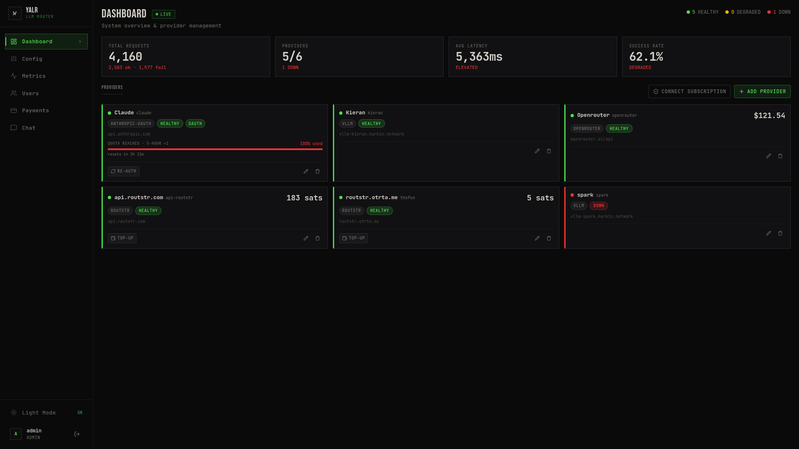
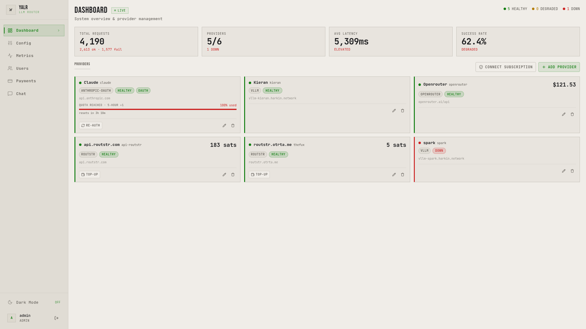

#### Metrics

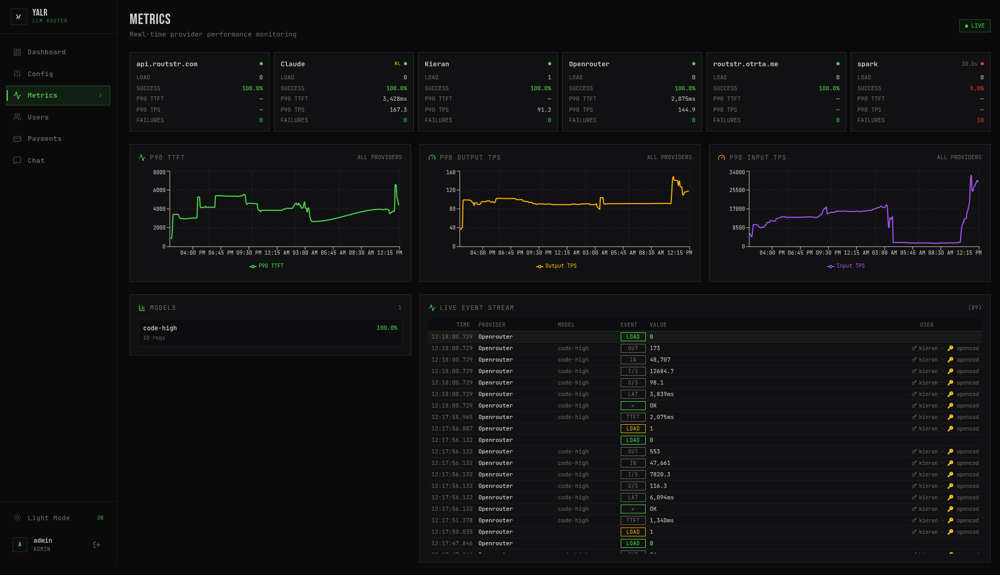
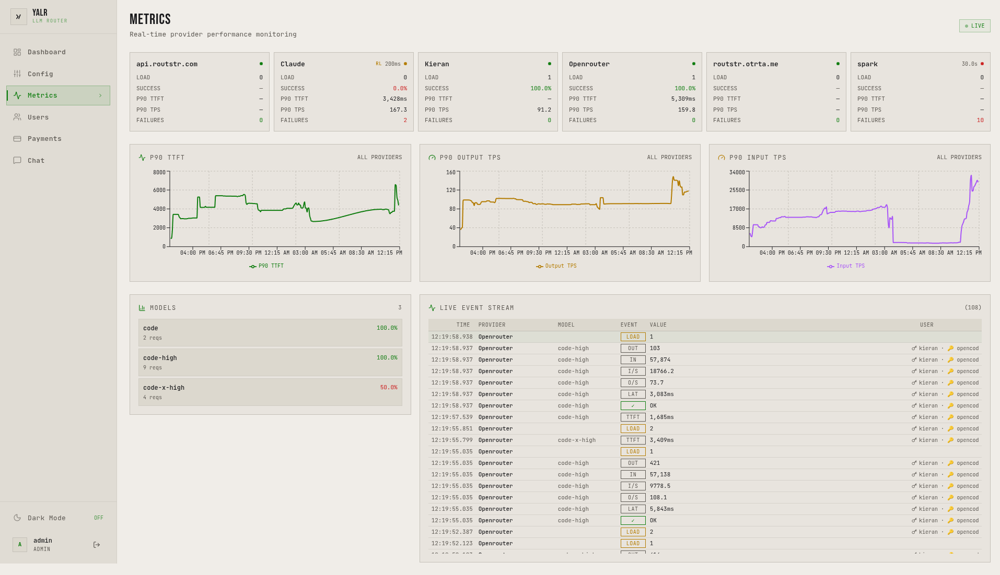

#### Config

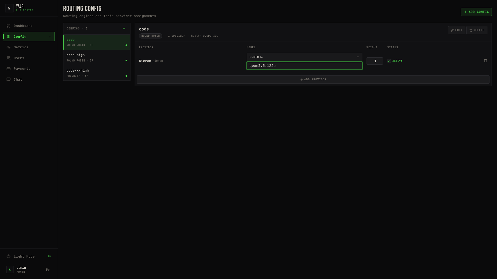
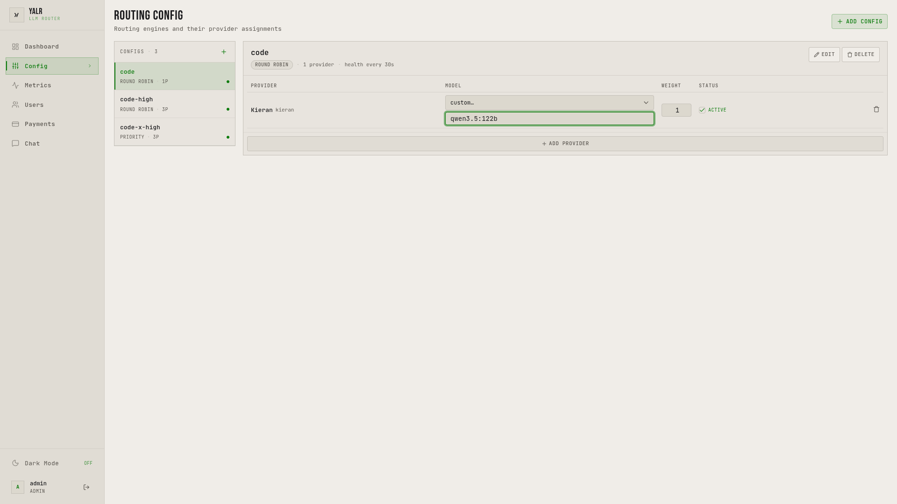

#### Users

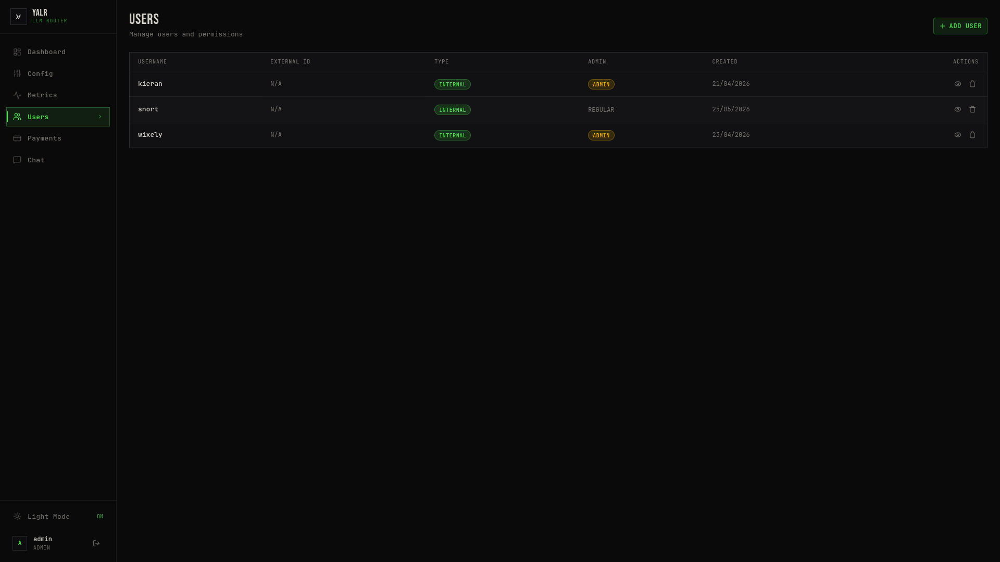
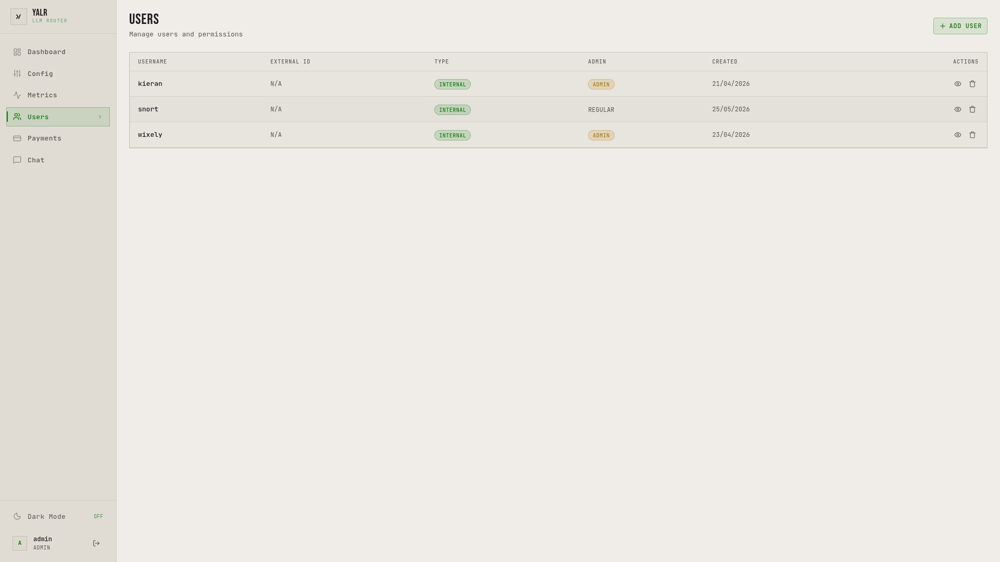

#### Payments

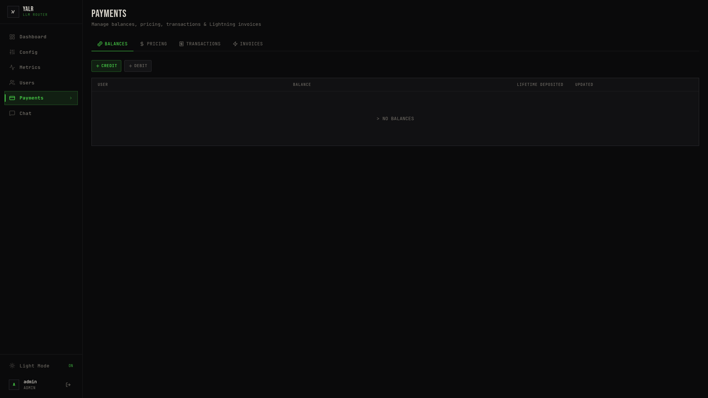
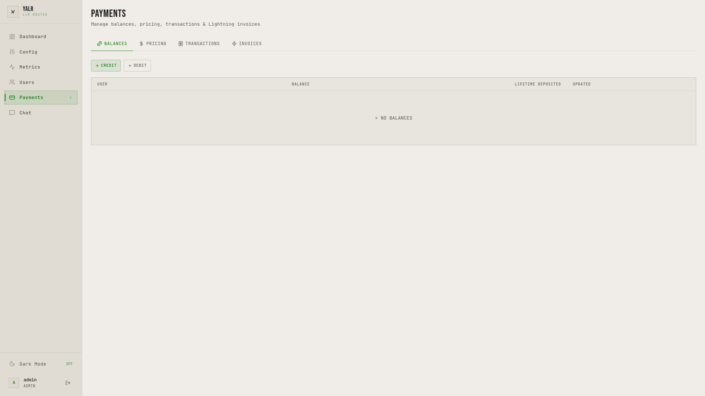

#### Chat


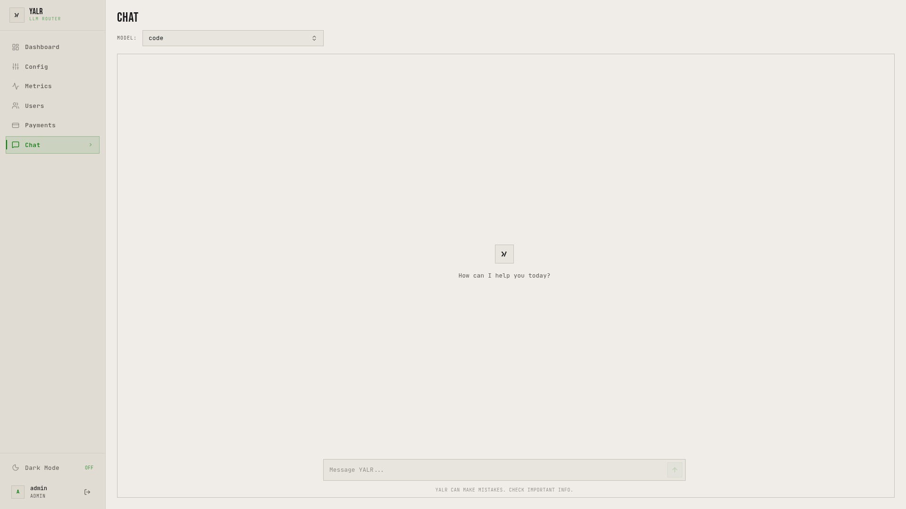

See [AGENTS.md](AGENTS.md) for full design philosophy, theme system rules, and implementation conventions.

### REST API

#### Auth & Setup
- `POST /api/auth/login` — Login (username/password or NIP-98 nostr event)
- `POST /api/auth/logout` — Logout current session
- `GET /api/auth/status` — Check authentication status
- `GET /api/setup/status` — Check if initial admin user exists
- `POST /api/setup/create` — Create first admin user

#### Providers
- `GET /api/providers` — List all providers
- `POST /api/providers` — Create new provider
- `PUT /api/providers/:slug` — Update provider
- `DELETE /api/providers/:slug` — Delete provider

#### Routing Config
- `GET /api/config` — List routing configs
- `POST /api/config` — Create routing config
- `PUT /api/config/:id` — Update routing config
- `DELETE /api/config/:id` — Delete routing config
- `GET /api/config/:id/providers` — List providers assigned to config
- `POST /api/config/:id/providers` — Add provider to config
- `DELETE /api/config/:id/providers/:slug` — Remove provider from config

#### Metrics & Health
- `GET /api/metrics` — Current provider performance metrics snapshot
- `GET /api/metrics/history` — Time-series P90 metrics history
- `GET /api/metrics/health` — Per-provider health state overview
- `WS /api/metrics/ws?token=...` — Real-time WebSocket event stream

#### Users & API Keys
- `GET /api/users` — List all users
- `POST /api/users` — Create user
- `DELETE /api/users/:id` — Delete user
- `GET /api/users/:id` — Get user detail
- `POST /api/users/:id/api-keys` — Create API key for user
- `POST /api/api-keys/:id/disable` — Disable API key
- `POST /api/api-keys/:id/enable` — Enable API key
- `DELETE /api/api-keys/:id` — Delete API key

#### Model Permissions
- `GET /api/users/:id/model-permissions` — Get user's model permission overrides
- `POST /api/users/:id/model-permissions` — Set model permission override
- `DELETE /api/users/:id/model-permissions/:id` — Delete override

#### Payments
- `GET /api/payments/balances` — All user balances
- `GET /api/payments/model-pricing` — Model pricing configuration
- `POST /api/payments/model-pricing` — Create pricing rule
- `PUT /api/payments/model-pricing/:id` — Update pricing rule
- `GET /api/payments/transactions` — Transaction history
- `GET /api/payments/invoices` — Invoice list
- `POST /api/payments/topup` — Create top-up invoice
- `POST /api/payments/adjust` — Admin credit/debit adjustment

#### Router
- `GET /health` - Health check
- `POST /v1/chat/completions` - Chat completion endpoint
- `GET /v1/models` - List available models

## Architecture

### Entry Points

- **Server**: `src/bin/server.rs` - HTTP server and API handlers
- **CLI**: `src/bin/cli.rs` - Command-line interface

### Core Components

```
┌─────────────────┐
│   Admin UI      │
│  (React/TS)     │
└────────┬────────┘
         │
┌────────▼────────┐
│   YALR Server   │
│   (Rust/Axum)   │
└────────┬────────┘
         │
    ┌────┴────┐
    │         │
┌───▼──┐  ┌──▼───┐
│Route │  │Auth  │
│Engine│  │Keys  │
└───┬──┘  └──┬───┘
    │        │
┌───▼────────▼──┐
│  Providers    │
│ (OpenAI, etc) │
└───────────────┘
```

### Routing Flow

**Prefixed models** (`provider-1/gpt-4`):
1. Split on `/` to get provider slug and model name
2. Route directly to specified provider via `RoutingEngine::route_by_slug()`
3. Bypasses load balancing

**Unprefixed models** (`gpt-4`):
1. Route through `RoutingEngine` for load-balanced selection
2. Match model name against `routing_config_providers` table
3. Use round-robin strategy to select from active providers
4. Fall back to first available routing config if no match

### Source Structure

```
src/
├── bin/
│   ├── server.rs    # HTTP server entry point
│   └── cli.rs       # CLI entry point
├── api/
│   └── handlers.rs  # HTTP request handlers
├── auth/            # Authentication (NIP-98, sessions)
├── db/              # Database layer (SQLite, migrations)
├── router/
│   ├── engine.rs    # Core routing engine
│   ├── model_router.rs  # Model-specific routing
│   └── strategies/  # Routing strategies
├── providers/       # Provider implementations
│   └── provider_trait.rs  # Provider trait definition
├── metrics.rs       # Metrics and health tracking
├── config.rs        # Configuration loading
└── state.rs         # Application state
```

## Health & Retry System

### Health States

- **Healthy**: Normal operation, accepting requests
- **Degraded**: Elevated error rate, still accepting but with backoff
- **Unhealthy**: High failure rate, temporarily unavailable

### Retry Behavior

- Automatic retry with exponential backoff (`base_backoff * 2^consecutive_failures`)
- Fallback to next available provider on failure
- Provider recovery after successful requests
- Respects `retry_after` headers from providers

## Testing

```bash
# Run all tests
cargo test

# Run library tests only
cargo test --lib

# Run specific test module
cargo test --lib router::model_router
```

Tests use:
- `wiremock` for HTTP mocking in provider tests
- In-memory SQLite (`sqlite::memory:`) for DB tests
- Inline test modules: `#[cfg(test)] mod tests { ... }`

## Deployment

### Docker

Multi-stage build with:
- Rust builder for compilation
- Bun for Admin UI build
- Debian slim runtime

### Docker Compose

```yaml
version: '3.8'
services:
  yalr:
    image: voidic/yalr:latest
    ports:
      - "3000:3000"
    volumes:
      - ./data:/app/data
      - ./config.yaml:/app/config.yaml
    healthcheck:
      test: ["CMD", "curl", "-f", "http://localhost:3000/health"]
      interval: 30s
      timeout: 10s
      retries: 3
```

## License

MIT
